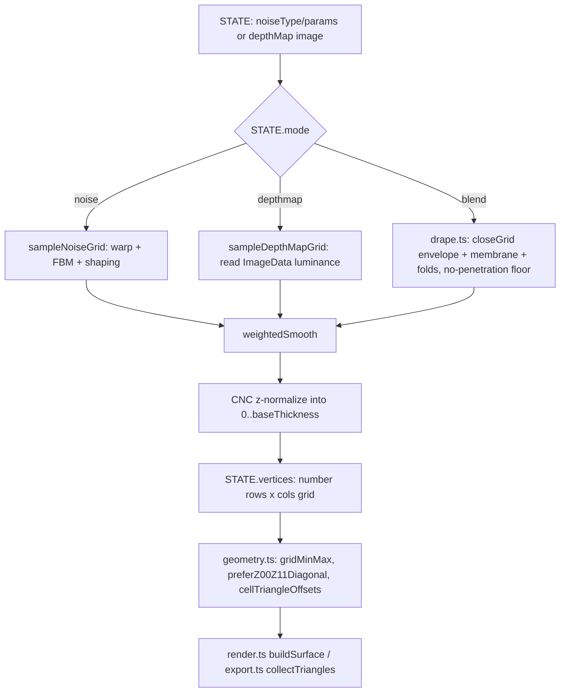

<!-- Captured from the Greptile knowledge base 2026-07-29. Greptile generated this from the
codebase and grounded its review findings in it; it is not hand-authored SOT.
Verify against live code before citing it as authoritative. -->

# Mesh Generation Core

MeshCraft turns either a procedural noise field or an uploaded grayscale depth-map image into a regular-grid heightfield, then triangulates that grid into 3D geometry consumed by the viewport renderer and the export/CNC pipelines. The pipeline lives mainly in `src/mesh.ts` (sampling, blending, CNC z-normalization) and `src/geometry.ts` (grid-to-triangle, watertight-enclosure, and the shared `weightedSmooth` blur); `src/types.ts` defines the shared grid/vertex contracts. Two sibling modules extend the depth-map path: `src/depth-estimate.ts` runs in-browser monocular depth estimation (Depth-Anything-V2-small via lazy-loaded transformers.js) to turn a photo into an actual depth image, and `src/drape.ts` implements the BLEND-mode "fabric over form" compositor (envelope/membrane/fold math) that `generateDepthMapMesh` calls into.

## Mental model

## Grid representation and shared types

The generation pipeline never produces a triangle mesh directly — it produces `STATE.vertices: number[][]`, a `rows x cols` grid of Z heights in inches (CNC machine-bed space), alongside `STATE.cols`/`STATE.rows`/`STATE.meshX`/`STATE.meshY`. Downstream consumers (`render.ts`, `export.ts`, `src/sbp/heightmap.ts`) convert this grid to full 3D vertices on demand via `x = (i/(cols-1))*meshX`, `y = (j/(rows-1))*meshY`. `src/types.ts` formalizes the richer shape as `MeshData` (`{ top: Vertex3D[][], cols, rows, meshX, meshY, baseThickness, watertight }`), built by `getFullMeshData()` in `src/export.ts` only when export/analysis code needs real `Vertex3D` points rather than raw numbers. `types.ts` also defines the noise-generator contracts (`NoiseGenerator`, `FBMGenerator`, `ReliefGenerator`, `NoiseGridParams`, `ReliefSampleParams`) that `mesh.ts` depends on — see `noise-and-relief-system` for how those generators are implemented.

## Noise-driven generation (`generateNoiseMesh`)

`generateNoiseMesh()` in `mesh.ts` reads noise parameters off `STATE` (frequency, octaves, persistence, lacunarity, contrast, sharpness, exponents, distortion/warp settings, smoothing), computes `cols`/`rows` from `STATE.resolution` and the mesh aspect ratio (`meshY/meshX`), and instantiates a generator via `createNoiseGen(noiseType, seed, noiseConfig)`. The per-pixel sampling loop lives in the internal `sampleNoiseGrid()`: for each grid cell it optionally applies domain warp (convergent or curl-based, blended by `warpCurl`), evaluates FBM or manual octave summation, then applies contrast/sharpness/exponent shaping (`noiseExp`, `peakExp` for peaks, `valleyExp`/`valleyFloor` for valleys). One generator kind is special-cased: if `gen.kind === 'voronoi-relief'`, `sampleNoiseGrid` skips its own per-pixel warp/FBM loop entirely and delegates to `gen.sampleGrid(reliefParams)` (params built by `sampleReliefParamsFromState`), because discrete Voronoi cells plus continuous domain warp produce visible tearing.

After sampling, `weightedSmooth()` (a 3x3 weighted-average blur, `iterations`/`strength` controlled) optionally relaxes the grid. The result is then remapped into CNC z-space: peaks map to `baseThickness` (stock top) and valleys to `baseThickness - cutDepth`, where `cutDepth = min(amplitude, baseThickness)`, followed by a hard clamp to `[0, baseThickness]`. When `STATE.watertight` is true, `baseThickness` is floored to `0.01` to avoid degenerate (zero-height) enclosure triangles.

## Depth-map generation and the drape compositor (`generateDepthMapMesh`)

`generateDepthMapMesh()` requires `STATE.depthMap` (an `HTMLImageElement` set by `loadDepthMap()` in `src/ui.ts`, or replaced in place by `runDepthEstimation()`); if absent it clears `STATE.vertices` and returns. It draws the image to an offscreen canvas and reads its red channel via `sampleDepthMapGrid()`, which bilinear-samples `ImageData` at each grid cell (`u,v` in `[0,1]` mapped to source pixel indices).

Depth data can come from two sources: raw image luminance (the default), or `src/depth-estimate.ts`'s `estimateDepth()`, which lazily dynamic-imports `@huggingface/transformers` and runs the `onnx-community/depth-anything-v2-small` model (WebGPU first, WASM fallback) to produce an actual monocular depth image from the source photo. `runDepthEstimation()` in `src/ui.ts` wires the "Estimate Depth" action: it swaps `STATE.depthMap` for the model's output, appends `' (AI depth)'` to `STATE.depthMapName` (guarding against re-estimating an already-estimated map), and guards against a stale closure if the user swaps images mid-inference. Both `INFERENCE_TIMEOUT_MS` (180s) and `LOAD_TIMEOUT_MS` (300s, covers first-run model download) reject a hung backend so the UI button isn't left disabled forever; failures are swallowed and the caller falls back to the luminance path since this feature is strictly additive.

`STATE.mode === 'blend'` no longer means a noise/depth-map crossfade — it now drives `src/drape.ts`'s fabric-over-form compositor. `generateDepthMapMesh` samples the depth map twice: `dmFine` (full-resolution, un-smoothed, normalized to `[0,1]`) carries fine detail, and `dmForm` (`dmSmoothing`-blurred from `dmFine` via `weightedSmooth`, now defined in `src/geometry.ts`) is the low-frequency form used to build the fabric. `closeGrid()` (`drape.ts`) morphologically closes `dmForm` into an `envelope` — a max-filter "shrinkwrap" that bridges concavities — and `membrane = lerp(dmForm, envelope, tension) + thicknessNorm`, where `tension = STATE.blend` and `thicknessNorm` derives from `STATE.drapeThickness`. A `contact` mask (smoothstep of the membrane-to-form gap) blends `dmFine`'s per-pixel detail back in wherever the fabric rests on the form (weighted by `STATE.drapeConform`), and `contourFolds()`/`slopeMask()` (`drape.ts`) add catenary wrinkles concentrated in slack/bridged zones. A hard no-penetration floor (`Math.max(h, dmFine)`) ensures the fabric never carves below the underlying form. Only after this composite is a single CNC z-normalization applied (`bt - cutDepth` to `bt`, offset by `dmOffset`). The pure depth-map path (`STATE.mode !== 'blend'`) skips the compositor entirely and normalizes/smooths/z-maps the depth grid alone.

`generateMesh()` in `mesh.ts` is the entry point called by UI slider changes (via `debouncedGenerate()`, 60ms debounce that skips regeneration for view-only keys like orbit/tilt/roll/zoom) and by `loadDepthMap()`. It dispatches on `STATE.mode` (`'noise'` / `'depthmap'` / a mixed mode that prefers `generateDepthMapMesh` if a depth map is loaded, else falls back to noise), wraps the call in two `requestAnimationFrame`s to let a loading overlay paint first, then triggers `renderViewport()` and `updateStats()`.

## Triangulation and enclosure geometry (`geometry.ts`)

`geometry.ts` holds pure, side-effect-free grid math shared by both the live Three.js viewport (`render.ts`) and the exporters (`export.ts`), plus `weightedSmooth()` — the 3x3 weighted-average blur (center 4, edge 2, corner 1) used by both the noise pipeline in `mesh.ts` and the drape compositor in `drape.ts`; it lives in `geometry.ts` specifically so `drape.ts` never needs to import `mesh.ts` (avoiding an import cycle). `gridMinMax()` scans a grid for its z-range (used for both color-ramp normalization and CNC clamps); `preferZ00Z11Diagonal()` picks the shorter-difference diagonal for each quad's split, reducing visible faceting on steep slopes; `cellTriangleOffsets()` returns CCW-wound flat-index triangle offsets for a quad based on that diagonal choice; `emitWatertightTriangles()` emits the bottom face and four side walls needed to make an exported mesh a closed solid, given flat top/bottom vertex array offsets. Both `render.ts`'s `buildSurface()`/`buildEnclosure()` and `export.ts`'s `collectTriangles()` independently re-triangulate the same `STATE.vertices` grid using these same helpers — they are not sharing a single triangulated mesh object, only the diagonal-selection logic.

## Change checklist

When these files or sections are changed, remember to consider these:

- If `sampleNoiseGrid`'s shaping pipeline (warp, FBM, contrast/sharpness/exponents) changes order or math, verify both `generateNoiseMesh` and the noise branch of `generateDepthMapMesh`'s blend path still produce a `[nMin,nMax]`-normalizable grid — both callers rely on `gridMinMax` afterward.
- If a new generator `kind` is added alongside `'voronoi-relief'` in `NoiseGenerator`/`types.ts`, add a matching branch in `sampleNoiseGrid` — generators are otherwise assumed to support the per-pixel `noise()`/`fbm()` contract, and an unhandled `kind` will silently fall through to the generic per-pixel loop.
- If `MeshData`/`Vertex3D` in `types.ts` changes shape, update both `getFullMeshData()` in `src/export.ts` and `src/sbp/heightmap.ts`'s conversion — they each independently reconstruct 3D geometry from `STATE.vertices`.
- If `baseThickness`/`watertight` clamping logic changes in `mesh.ts`, check `export.ts`'s `getFullMeshData()`, which re-applies its own `Math.max(baseThickness, 0.01)` floor for watertight exports — the two floors must stay consistent or exported geometry will disagree with the viewport.
- If `cols`/`rows` computation (`Math.max(2, resolution)`, aspect-derived rows) changes, verify `render.ts`'s `buildSurface`/`buildEnclosure` and `export.ts`'s `collectTriangles`, which all assume `STATE.cols`/`STATE.rows` match the actual length of `STATE.vertices`.
- If `weightedSmooth`'s signature or kernel weights change in `geometry.ts`, verify both `mesh.ts` (noise/depth-map smoothing) and `drape.ts` (envelope post-close smoothing) still call it consistently — they share this one implementation to avoid an import cycle.
- If `src/depth-estimate.ts`'s `DepthOutput` shape or timeout constants change, check `runDepthEstimation()` in `src/ui.ts`, which assumes the resolved image has `width`/`height` and treats any rejection as "fall back to luminance."
- If drape parameters (`drapeFoldScale`, `drapeThickness`, `drapeConform`, etc.) are added/renamed in `src/state.ts`, update the corresponding slider in `src/ui.ts` and the destructure in `generateDepthMapMesh` (`src/mesh.ts`).

## Important failure modes

| Trigger | Consequence | Guard |
|---|---|---|
| `STATE.depthMap` is null when `generateDepthMapMesh()` runs | `STATE.vertices` set to `null`, viewport/export show nothing | Explicit early-return check in `mesh.ts` |
| `cols < 2` or `rows < 2` | `getFullMeshData()` returns `null`, export silently no-ops | Guard in `src/export.ts`; `mesh.ts` also floors `resolution` to 2 and `rows` to 4 |
| `baseThickness` set to 0 with `watertight` true | Would produce zero-height enclosure walls (degenerate triangles) | Both `mesh.ts` and `export.ts` floor `baseThickness` to `0.01` independently when watertight |
| `nMax === nMin` (flat noise/depth grid) | Division by zero in normalization | Both `mesh.ts` and `render.ts` use `range || 1` fallback |
| Domain warp (`distortion > 0`) combined with `voronoi-relief` generator | Would tear cell boundaries | `sampleNoiseGrid` special-cases `gen.kind === 'voronoi-relief'` and skips its own warp path entirely |

## Key files

| File | Why to read it |
|---|---|
| `src/mesh.ts` | Core pipeline: noise sampling, depth-map sampling, drape compositor invocation, CNC z-normalization, debounced regeneration entry point |
| `src/geometry.ts` | Shared grid-to-triangle math (diagonal selection, triangle offsets, watertight enclosure) and `weightedSmooth`, used by both viewport/export and the drape compositor |
| `src/drape.ts` | BLEND-mode fabric compositor: `closeGrid` (morphological envelope), `contourFolds`, `slopeMask` |
| `src/depth-estimate.ts` | Lazy-loaded Depth-Anything-V2 monocular depth inference (`estimateDepth`), timeouts, WebGPU/WASM fallback |
| `src/types.ts` | Grid/vertex/mesh data contracts (`MeshData`, `Vertex3D`, `NoiseGridParams`, generator interfaces) shared across the pipeline |
| `src/render.ts` (`buildSurface`, `buildEnclosure`) | Consumes `STATE.vertices` to build the live Three.js scene; independent re-triangulation from `export.ts` |
| `src/export.ts` (`getFullMeshData`, `collectTriangles`) | Consumes `STATE.vertices` to build `MeshData`/triangles for STL/OBJ export |
| `src/ui.ts` (`loadDepthMap`, `fitMeshToAspect`, `runDepthEstimation`) | Loads user depth-map image into `STATE.depthMap`, optionally runs AI depth estimation, and triggers `generateMesh()` |
| `src/state.ts` | Defines all `STATE` fields the pipeline reads (`resolution`, `mode`, `blend`, `drapeFoldScale`/`drapeThickness`/`drapeConform`, `baseThickness`, `watertight`, etc.) |
