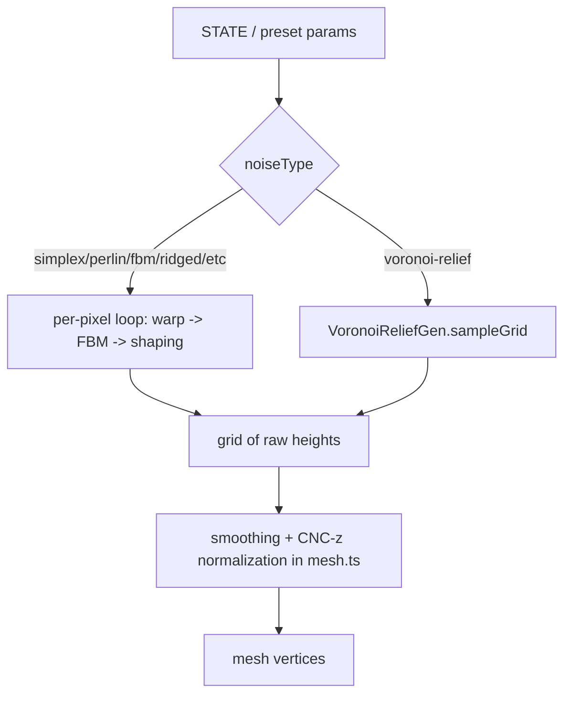

<!-- Captured from the Greptile knowledge base 2026-07-29. Greptile generated this from the
codebase and grounded its review findings in it; it is not hand-authored SOT.
Verify against live code before citing it as authoritative. -->

# Noise and Relief System

Procedural height data for meshes comes from pluggable noise generators in `src/noise/generators.ts`, selected by name via `createNoiseGen`. Most types are per-pixel scalar fields sampled inside a shared warp/FBM/shaping loop in `src/mesh.ts`. The Voronoi relief type (`src/noise/voronoi-relief.ts`) is different: it is grid-aware, computing cell identity and per-cell radius across the whole panel before any per-pixel value can be produced, so it bypasses that shared loop entirely. Presets in `src/noise/presets.ts` bundle noise type plus all shaping/mesh parameters into one-click configurations, including three Voronoi-relief presets that reproduce a specific "lafabricatrun" reference look.

## Mental model

## Base and fractal generators

`generators.ts` implements one family of interchangeable `NoiseGenerator`/`FBMGenerator` classes: `SimplexNoiseGen`, `PerlinNoiseGen`, `ValueNoiseGen`, `OpenSimplex2NoiseGen` as raw noise; `RidgedNoiseGen`, `BillowNoiseGen`, `FBMNoiseGen`, `TurbulenceNoiseGen` as basic fractal wrappers; `HybridMultifractalGen` and `HeteroTerrainGen` as multifractal variants that weight each octave by the running result; `DomainWarpNoiseGen` which warps its own coordinates using a second Simplex field before sampling; `VoronoiNoiseGen` and `WorleyNoiseGen` as cellular (F1/F2 distance) noise; and `GaborNoiseGen`/`WaveletNoiseGen` as more specialized textures (oriented Gabor kernels, a precomputed tileable wavelet grid). All of these implement `.noise(x, y)` and, where fractal, `.fbm(x, y, octaves, persistence, lacunarity)`. `createNoiseGen(type, seed, config)` is the single factory switch; `voronoi-relief` is the one case that returns a `VoronoiReliefGen` rather than a plain `NoiseGenerator`.

`src/mesh.ts`'s `sampleNoiseGrid` (around line 31) is the shared per-pixel driver for every type except `voronoi-relief`: for each grid cell it optionally applies domain warp (convergent + curl blend, using a `warpGen` Simplex instance), samples the generator's `fbm` or manual octave loop, then applies `contrast`, `sharpness`, `noiseExp`, `peakExp`/`valleyExp`, and `valleyFloor` shaping in a fixed order. The result is a raw, un-normalized grid; `generateNoiseMesh` (and the depth-map blend path further down `mesh.ts`) then smooths and runs a single CNC-z normalization pass over the combined data.

## Voronoi relief: why it needs its own path

`VoronoiReliefGen.sampleGrid` (`src/noise/voronoi-relief.ts`, at v23) produces 3D cellular relief modeled on a specific reference panel (`docs/voronoi-relief-target-spec.md`, the "lafabricatrun" carved-wood target spec) — cells carved into a smooth undulating base surface, separated by finite-width walls, with radial "starburst" site lattices and per-cell membrane cushions. This cannot be a per-pixel scalar function because every sample needs cell identity (which site owns this pixel) and a per-cell radius (how big is this cell relative to its neighbors), both of which require knowing the whole site layout first. `sampleNoiseGrid` special-cases `gen.kind === 'voronoi-relief'` and calls `sampleGrid` directly instead of routing through the warp/FBM loop; per-pixel domain warp is skipped entirely for this type because warping discrete cell boundaries tears them visually — instead all distance queries run through a flow warp `W(x,y)` (Pass 1, Lloyd samples, radius field, Pass 2 all query the warped domain) so ownership boundaries stay clean curves while cells still stretch and flow.

The algorithm's structural mechanisms (v16+):

- **Base superposition**: final height is `base + polarity·bowl·…`, where `base` is an independent low-frequency wave field (`reliefBaseAmplitude`/`reliefBaseFrequency`) — ridge crests follow this undulating base instead of collapsing onto a flat reference plane.
- **Wall band**: `wallWidth` holds a band of normalized cell distance at base level around every cell boundary before the bowl profile starts, giving walls finite width instead of knife-edge ridges.
- **Starburst site layout** (`generatePolarSites`): around 0–3 user-placed foci, jittered polar ring lattices (nucleus + spiral arms) produce radially elongated petal cells — a site-layout mechanism, not a warp, since a radial displacement warp cannot produce true petals without compressing somewhere in its falloff annulus.
- **Site generation** (`generateSites`) otherwise lays a jittered grid of sites in physical mesh units sized by `cellSize`, with density further modulated by an attractor mask and `reliefDensityNoise` (low-frequency multi-scale patchiness). `SITE_COUNT_MAX` (4096) and `LOCAL_DENSITY_MAX` (4) hard-cap this against pathological params.
- **Lloyd relaxation** (`lloydRelax`, 0–2 passes, Halton low-discrepancy sampling in the warped domain) smooths out irregular cell sizes.
- **Radius field** (Pass 1 finds F1/owning site and accumulates mean F1 per site; Pass 1.5 Gaussian-blends per-site radii into a continuous field on a coarse grid, bilinear-upsampled) so per-pixel radius reads are C0-continuous — the key fix for the spike/sawtooth artifacts in the code history.
- **Membrane cushions** (v22–v23): rather than a distance-field crown, cushion shape comes from a per-cell Poisson (Gauss-Seidel/SOR) relaxation over cushion-region pixels, clamped to zero at the gutter ring — replacing an earlier medial-axis-traced crown that produced biased, uneven cushions. `pillowCoverage === 0` must fully disable cushions even though the smooth threshold alone would leave a residual.
- **Pass 2** re-samples F1/F2/F3 at `W(x,y)`, remaps through the wall band, applies the bowl profile, superposes onto the base wave, adds junction lift `(F3-F1)/(2R)` (`reliefJunctionLift`) so crests rise toward three-way junctions, applies per-cell depth-tier/seam-jitter variation (`reliefDepthVariation`), and clamps output to `±OUTPUT_HEIGHT_CLAMP` (1.05), left in noise-native range for the standard mesh normalization to handle.

`sampleReliefParamsFromState` adapts `STATE` fields (all the `relief*` keys plus the shared `distortion`/`warpFreq` sliders) into the `ReliefSampleParams` struct `sampleGrid` expects, and is the only place that wires the global warp UI into relief mode.

## Presets

`presets.ts` exports `PROFILES` (shape-only overrides: octaves/persistence/lacunarity/distortion/contrast/sharpness for smooth/rough/organic/geometric/crystalline/waves) and `CNC_PRESETS`, which bundle a full noise type plus mesh/smoothing parameters keyed by name (e.g. `gentle-waves`, `sharp-ridges`, `voronoi-cells`). Presets are merged as key-only overlays onto state — a preset that omits a field inherits whatever the previously active preset left behind, which is why several relief presets explicitly zero out fields like `reliefAttractorNoise` or `reliefFlowAnisotropy` that a sibling preset sets non-zero.

Three relief presets target a specific reference look (`lafabricatrun`-style wood carvings):
- `relief-vertical`: smooth wave field at top fading to dense domed cells at the bottom (`attractorMode: 'vertical'`, `attractorY: 0`).
- `relief-radial`: cell density radiating from a point, `baseMode: 'flat'`.
- `relief-pockets`: inverted (`polarity: 'pockets'`) dramatic cell-size variation with deep seams; its comment block documents three artifact classes found and fixed across iterations (void-mode plateaus, anisotropy-driven F1 tearing, and per-cell radius mismatch from extreme `attractorNoise`), each traceable to a specific commit in the file's history.

## Change checklist

When these files or sections are changed, remember to consider these:

- If a new field is added to `ReliefSampleParams` (`src/types.ts`), update both `sampleReliefParamsFromState` in `voronoi-relief.ts` and every relevant `CNC_PRESETS` entry in `presets.ts` — presets merge by key, so a missing key silently falls back to whatever the prior preset left in `STATE`, not a documented default.
- If `createNoiseGen`'s switch in `generators.ts` gains a new `type` string, verify `sampleNoiseGrid` in `src/mesh.ts` still special-cases it correctly (grid-aware types must skip the per-pixel warp/FBM loop) and that `NoiseGridParams`/`ReliefGenerator` typing in `src/types.ts` covers the new generator's shape.
- If any of the tuning constants at the top of `voronoi-relief.ts` (`SITE_COUNT_MAX`, `RADIUS_FIELD_SIGMA_CELLS`, `SEAM_MIN_PIXEL_WIDTH`, etc.) are changed, re-verify against production-resolution timing — several exist specifically to keep two O(rows·cols·sites) passes under ~1s.
- If the global `distortion`/`warpFreq` sliders' semantics change in `mesh.ts`'s per-pixel warp path, check `sampleReliefParamsFromState` still maps them consistently into `warpDistortion`/`warpFrequency` for site-position warping.
- If mesh-side smoothing or CNC-z normalization in `src/mesh.ts` changes its assumed input range, verify it still matches the `±OUTPUT_HEIGHT_CLAMP` (1.05) contract that `VoronoiReliefGen.sampleGrid` outputs.

## Important failure modes

| Trigger | Consequence | Guard |
|---|---|---|
| Per-cell radius read from a discrete per-site lookup instead of the continuous `Rfield` | Spike/sawtooth artifacts at cell ownership (F1/F2) boundaries | Pass 1.5 Gaussian-blended `Rfield`, bilinear-interpolated (`c40c67b`, `5d838d0`) |
| `transitionSoftness` allowed outside `[0,1]` | `Math.pow` with a non-positive exponent can produce `Infinity`, which the non-finite guard flattens to 0, punching dead bands into the mesh | Explicit clamp before computing `transitionExponent` in `sampleGrid` |
| Seam smoothstep width computed only as `seamWidth * R` at low grid resolution or small cells | Aliased/staircased walls (dotted-wall artifact) | `pixelMinWidth` floor capped to `SEAM_FLOOR_MAX_R_FRACTION` of R |
| High `voidStrength` + high `anisotropy`/`attractorNoise` together (pre-iteration-7 relief-pockets tuning) | Disconnected dark plateaus and torn wall network in rendered mesh | Continuous void gate via smoothstep, F1 read through anisotropic rotation consistently, radius field over discrete per-site lookup (`b6e47c7`, `b281ef6`) |
| Crafted/URL-supplied relief params with huge `densityStrength` or tiny `cellSize` | Site count or per-cell density explodes, freezing the tab | `SITE_COUNT_MAX`, `LOCAL_DENSITY_MAX` hard caps in `generateSites` |

## Key files

| File | Why to read it |
|---|---|
| `src/noise/generators.ts` | All per-pixel noise/fractal generator classes and the `createNoiseGen` factory switch |
| `src/noise/voronoi-relief.ts` | Grid-aware Voronoi relief algorithm: site generation, Lloyd relaxation, radius field, dome/seam/attractor compositing |
| `src/noise/presets.ts` | `PROFILES` shape presets and `CNC_PRESETS` full configuration presets, including the three relief presets and their tuning history in comments |
| `src/mesh.ts` | `sampleNoiseGrid` (shared per-pixel loop and the `voronoi-relief` bypass), `generateNoiseMesh` (wires STATE into generators and presets, then smooths/normalizes) |
| `src/types.ts` | `NoiseGenerator`, `FBMGenerator`, `ReliefGenerator`, `ReliefSampleParams`, and related enum types shared across generators and mesh code |
| `docs/voronoi-relief-target-spec.md` | Author-written acceptance spec describing the reference "lafabricatrun" panel geometry and a mechanism-mapping table tying each spec property to a sampler mechanism |
| `cli/voronoi-relief.spec.ts` | Deterministic regression suite (18+ assertion blocks) that guards `sampleGrid` behavior against reintroducing prior artifacts (see `docs/cli-tools.md`) |
