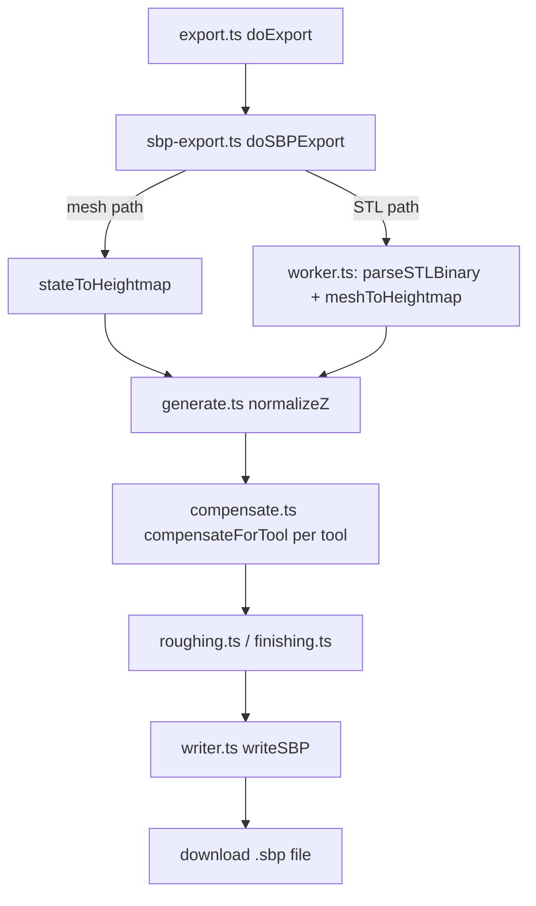

<!-- Captured from the Greptile knowledge base 2026-07-29. Greptile generated this from the
codebase and grounded its review findings in it; it is not hand-authored SOT.
Verify against live code before citing it as authoritative. -->

# SBP Export Pipeline

The app converts a generated heightfield mesh (or an uploaded STL) into ShopBot OpenSBP CNC toolpath code. `src/export.ts` dispatches to `src/sbp-export.ts`, which builds cutting config from UI state and either runs the pipeline inline (current mesh) or offloads it to `src/sbp/worker.ts` (uploaded STL), which chains `src/sbp/stl-parser.ts` -> `src/sbp/heightmap.ts` -> `src/sbp/compensate.ts` -> `src/sbp/roughing.ts`/`src/sbp/finishing.ts` -> `src/sbp/writer.ts`.

## Mental model

## Entry points and dispatch

`src/export.ts`'s `_doExportInner` checks `STATE.exportFormat`; when it is `'sbp'` it calls `doSBPExport()` from `src/sbp-export.ts` and returns immediately (no shared post-processing with the other export formats). `doSBPExport` picks one of two source paths based on whether an STL was uploaded (`SBP_STATE.stlBuffer`):

- **Mesh path** (`exportFromMesh`): uses the currently generated `STATE.vertices` grid directly, via `stateToHeightmap` in `src/sbp/heightmap.ts`. This assumes `STATE.vertices` is already a regular row/col grid in CNC Z space — no rasterization needed.
- **STL path** (`exportFromSTL`): spawns a Web Worker from `src/sbp/worker.ts` and posts the raw STL `ArrayBuffer`, the resolved `SbpConfig`, and a heightmap `resolution` (cells per inch). The worker owns the CPU-heavy parse + rasterize + toolpath-generation work off the main thread; `sbp-export.ts` guards against concurrent runs with `sbpWorkerRunning` and re-attaches the transferred `stlBuffer` on both success and error so the UI can retain the uploaded file.

Both paths converge on the same `generateSBP` function (`src/sbp/generate.ts`), so behavior is identical for a given heightmap regardless of source — the worker doesn't get a different pipeline.

## Config resolution

`buildConfig()` in `sbp-export.ts` starts from `getDefaultConfig(profile)` (`src/sbp/tools.ts`), then layers in UI state: enable flags, `STATE.baseThickness` as `materialZ`, offsets, safe/home Z, leave-stock, raster angle, and per-parameter overrides (feed rate, plunge rate, RPM, stepdown, stepover) the user dragged from the profile default. `src/sbp/tools.ts` embeds a fixed ATC tool table (`EMBEDDED_TOOLS`) with geometry (type, diameter, tip radius, half-angle) and per-`MaterialProfile` (`general`/`mdf`/`hardwood`) cutting params sourced from Vectric `.vtdb` exports; `resolveCutting` falls back to `general` then the first available profile. Default roughing tool is the "Chipbreaker" end mill; default finishing tool is "TBN R1/16-S1/4" (tapered ball nose).

## Stage 1: getting a heightmap

A `Heightmap` (`src/sbp/types.ts`) is a regular `Float64Array` Z-grid plus `rows`/`cols`/`cellSize`/`meshX`/`meshY`. Two producers:

- `stateToHeightmap` (`src/sbp/heightmap.ts`) — trivial reshape of `STATE.vertices` (`number[][]`) into the flat grid; `cellSize` is derived as `meshX / (cols - 1)`.
- `meshToHeightmap` (`src/sbp/heightmap.ts`), fed by `parseSTLBinary` (`src/sbp/stl-parser.ts`) — parses a binary STL into a `Float32Array` (12 floats/triangle: normal + 3 vertices) with bounds tracked in the same pass. `meshToHeightmap` then rasterizes: for each triangle, it walks its XY bounding box in grid cells and barycentrically interpolates Z, keeping the max Z per cell (top-surface wins on overlap). A gap-fill pass expands a nearest-neighbor ring (up to 5 cells) for any cell no triangle touched, falling back to the STL's global minimum Z if nothing is found within that radius.

## Stage 2: Z normalization

`generateSBP` (`src/sbp/generate.ts`) first calls internal `normalizeZ`, which shifts the entire grid up if any Z value is negative (so all cutting is above the table), and bumps `config.materialZ` up if it doesn't already clear the surface's max Z plus a small margin. This guarantees stock thickness is never thinner than the tallest point on the part, which the finishing stage's boundary traverse (see below) depends on.

## Stage 3: tool compensation

`compensateForTool` (`src/sbp/compensate.ts`) performs a separable 2-pass morphological erosion of the heightmap per tool, computing the actual Z the tool center can reach without gouging the surface. `toolZOffset` models tool geometry by `ToolType`: ball nose and tapered-ball-nose use hemisphere/taper offset math (`R - sqrt(R^2 - d^2)` near center, linear taper beyond the transition radius for TBN/V-bit), while end mill and radiused tools are flat within their radius (radiused adds a rounded edge). The kernel's half-width is capped at the tool's physical radius (not the theoretical taper projection, which diverges for shallow taper angles). This step runs independently for the roughing tool and the finishing tool, producing two different compensated heightmaps even though they share the same source surface.

## Stage 4: toolpath generation

- `generateRoughing` (`src/sbp/roughing.ts`) computes discrete Z levels from `materialZ` down to a fixed 0.050" floor, stepping by the roughing tool's `stepdown`. At each level it serpentine-rasters (alternating sweep direction) at `stepover`-cell intervals, cutting `max(zLevel, surfaceZ + leaveStock)` so it never removes the reserved finishing allowance — retracting to `safeZ` between disconnected cut segments.
- `generateFinishing` (`src/sbp/finishing.ts`) instead produces one continuous toolpath: `computeRasterLines` computes parallel lines across the workpiece at `finishRasterAngle` degrees (default 45), and each line is sampled at a uniform 0.005" spacing with Z from `bilinearInterp` of the compensated heightmap (no point-reduction, for consistent surface finish). Between lines, the tool traverses at `materialZ` rather than retracting to `safeZ` — this is only safe because Stage 2 guaranteed `materialZ` clears the surface; `generateFinishing` throws if a line endpoint's Z would exceed `materialZ` at traverse time, catching a `normalizeZ` regression early.

`generateSBP` runs whichever of roughing/finishing are enabled (independently toggleable) and collects their `ToolpathSection`s.

## Stage 5: writing OpenSBP

`writeSBP` (`src/sbp/writer.ts`) serializes header comments (material extents, home/safe Z), then per-section tool-change (`C9`), spindle-on (`C6`/`TR`), and feed-rate (`MS`) commands, followed by move lines: `J3` for rapids, `M3` for cuts, 6 decimal places. It inserts an intermediate retract-to-`safeZ` `J3` when transitioning from a cut back to a rapid, and a final home move (`J3` then `JZ` to `homeZ`) at the very end. The format is stated as verified line-by-line against Aspire reference output — any layout change here should be diffed against a known-good reference file, not just visually inspected.

## Change checklist

When these files or sections are changed, remember to consider these:

- If `SbpConfig` or `ToolDef`/`CuttingParams` in `src/sbp/types.ts` change shape, update all three producers of `SbpConfig` (`getDefaultConfig` in `src/sbp/tools.ts`, `buildConfig` in `src/sbp-export.ts`) and the worker's `WorkerInput`/message contract in `src/sbp/worker.ts`, which structurally clones the config across the postMessage boundary with no schema validation.
- If `ToolType` gains a new variant or geometry parameter, `toolZOffset` in `src/sbp/compensate.ts` must add a matching branch — an unhandled type falls into the `default` (flat end mill) case silently, producing a wrong (non-gouging-checked) toolpath rather than an error.
- If the roughing floor (0.050", `src/sbp/roughing.ts`) or the finishing traverse height contract (`materialZ` must clear all surface points, enforced by `normalizeZ` in `src/sbp/generate.ts`) changes, re-verify `generateFinishing`'s boundary-traverse assumption in `src/sbp/finishing.ts` — it throws instead of silently gouging, so a `normalizeZ` change that stops guaranteeing headroom will surface as a hard export failure, not corrupted G-code.
- If `src/sbp/writer.ts`'s move/command format changes, re-diff full sample output against the Aspire reference; the format comment states it was verified line-by-line and downstream ShopBot controllers parse it literally.
- The Voronoi-relief stepover warning in `src/sbp-export.ts` (`buildReliefStepoverWarning`) hardcodes a physical seam-width derivation tied to `voronoi-relief.ts`'s seam smoothstep gate; if that noise algorithm's seam geometry changes, this warning's math goes stale silently (it will just produce a wrong recommended stepover, not an error).

## Important failure modes

| Trigger | Consequence | Guard |
|---|---|---|
| STL with degenerate XY bounds (zero width/height) | `meshToHeightmap` throws `Degenerate STL bounds` | `src/sbp/heightmap.ts` bounds check before rasterizing |
| STL buffer truncated or corrupted | `parseSTLBinary` throws on size mismatch or zero-triangle count | `src/sbp/stl-parser.ts` validates header + expected byte length up front |
| Large gaps (>5 cells) in triangle coverage after rasterization | Gap cells fall back to global STL min Z, potentially cutting far too shallow/deep in that region | `MAX_GAP_RADIUS` ring search in `src/sbp/heightmap.ts`, silently falls through rather than erroring |
| `materialZ` drops below the compensated surface between normalization and finishing traverse | `generateFinishing` throws `Finishing traverse requires materialZ to be above the surface` | explicit check in `src/sbp/finishing.ts` before emitting boundary-traverse moves |
| Second STL export triggered while worker still running | Blocked with a toast, no queued retry | `sbpWorkerRunning` flag in `src/sbp-export.ts` |
| Worker throws during parse/generate (e.g. bad STL) | `postMessage` returns an `{type:'error'}` payload; STL buffer is returned so UI doesn't lose the upload | try/catch in `src/sbp/worker.ts`'s `onmessage` |

## Key files

| File | Why to read it |
|---|---|
| `src/export.ts` | Top-level export dispatcher; routes `fmt === 'sbp'` to `doSBPExport` and returns early, bypassing other export formats' shared logic |
| `src/sbp-export.ts` | UI wiring, config assembly (`buildConfig`), source selection (mesh vs. STL), worker invocation, download + toast handling |
| `src/sbp/types.ts` | Canonical shapes: `SbpConfig`, `ToolDef`, `Heightmap`, `ToolpathMove`/`Section`, `SbpStats` |
| `src/sbp/tools.ts` | Embedded ATC tool table and per-material cutting params; default tool/config resolution |
| `src/sbp/stl-parser.ts` | Binary STL -> flat `Float32Array` + bounds, single-pass, validated |
| `src/sbp/heightmap.ts` | Two heightmap producers: STL rasterization (`meshToHeightmap`) and mesh reshape (`stateToHeightmap`) |
| `src/sbp/generate.ts` | Pipeline orchestrator (`generateSBP`), Z normalization |
| `src/sbp/compensate.ts` | Tool-radius compensation via separable morphological erosion, per `ToolType` geometry |
| `src/sbp/roughing.ts` | Z-level serpentine raster roughing toolpath |
| `src/sbp/finishing.ts` | Continuous angled-raster finishing toolpath with boundary traverses |
| `src/sbp/writer.ts` | OpenSBP text serialization (header, tool changes, moves, footer) |
| `src/sbp/worker.ts` | Web Worker entry: STL parse -> heightmap -> `generateSBP`, transferable-buffer messaging |
