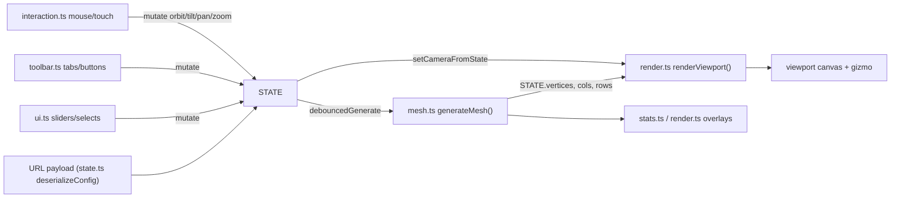

<!-- Captured from the Greptile knowledge base 2026-07-29. Greptile generated this from the
codebase and grounded its review findings in it; it is not hand-authored SOT.
Verify against live code before citing it as authoritative. -->

# UI and State

MESHCRAFT is a single-page app built around one global mutable object, `STATE` (`src/state.ts`), that every other module reads and writes directly — there is no reactive framework or dispatch layer. The sidebar (`src/ui.ts`), toolbar (`src/toolbar.ts`), viewport interaction (`src/interaction.ts`) and renderer (`src/render.ts`) all mutate `STATE` in place and then call `generateMesh()`/`debouncedGenerate()` or `renderViewport()`/`requestRender()` to propagate the change. `src/main.ts` is the sole entrypoint, wiring DOM structure from `index.html` to these modules on `DOMContentLoaded`.

## Mental model

## State shape and lifecycle

`MeshState` (`src/state.ts`) is one flat interface holding every dial in the app: noise parameters, voronoi-relief parameters, mesh dimensions, depth-map settings, camera/view transform, export options, and internal generation results (`vertices`, `cols`, `rows`, `genTime`, `sbpStats`). `STATE` is a live singleton (`export const STATE: MeshState = { ...DEFAULTS }`), and `DEFAULTS` is the reset target used by double-click-to-reset (`slider-utils.ts`) and the "Reset View" button (`toolbar.ts`). There is no separate "commit" step — assigning to `STATE.foo` is itself the state update.

A parallel path lets state travel in a URL: `serializeConfig()` diffs `STATE` against `DEFAULTS` over a curated `URL_SERIALIZABLE_KEYS` allowlist, base64url-encodes the diff, and tags it with a payload version (`CURRENT_PAYLOAD_VERSION`). `deserializeConfig()` (invoked once, in `main.ts`'s `init()`) reverses this, applying legacy default backfills (`LEGACY_V0_DEFAULTS` through `LEGACY_V4_DEFAULTS`) for older payload versions so that older share links keep rendering the same shape after `DEFAULTS` changes. `findEncodedPayload()` tolerantly extracts the payload from query string, hash, or even a malformed path (an iOS clipboard failure mode). Numeric fields that could cause pathological O(rows·cols·sites) relief computation (`reliefRelaxIterations`, `reliefDensityStrength`, etc.) are clamped after decode since URL payloads are untrusted input, unlike slider-driven values which are already range-limited by the DOM.

`noiseDims` is a small side-cache (not part of `MeshState`) that preserves noise-mode mesh dimensions across mode switches, since depth-map mode overwrites `meshX`/`meshY`/`resolution` via `fitMeshToAspect()`.

## Sidebar construction and control wiring

`buildSidebar()` in `src/ui.ts` is the single function that reconstructs the entire sidebar DOM from current `STATE`; it is called on init, on noise-type change, on preset/profile selection, on depth-map load, and on mode switch — anywhere the set of *visible* controls must change (e.g. relief mode shows `buildReliefSection()` instead of `buildPeakValleySection()`/`buildAdvancedNoiseSection()`; BLEND mode shows drape fold/thickness/conform sliders wired to `src/drape.ts`'s compositor, documented in `mesh-generation-core`). `runDepthEstimation()` in `ui.ts` drives the "Estimate Depth" button, calling `estimateDepth()` (`src/depth-estimate.ts`) to replace `STATE.depthMap` with an AI-inferred depth image; see `mesh-generation-core` for the model/timeout details. Each control is built declaratively via `slider()` or `enumSelect()` helpers that read the current `STATE[key]` value and stamp a `data-key` attribute; `wireControls()` then does one generic query (`input[type=range][data-key]`, `select[data-key]`) to attach `input`/`change` listeners rather than each section wiring itself. This generic-wiring pattern means any new slider or select just needs the `data-key` attribute — no per-control listener code.

Slider input handlers do several side effects beyond `STATE[key] = v`: they resync the value badge, cascade aspect-locked mesh dimensions (`meshX`/`meshY` cross-update when `STATE.aspectLocked`), clamp cut-depth sliders (`amplitude`, `dmHeightScale`) to `STATE.baseThickness`, resync the SBP safe-Z (`syncSbpSafeZ()`, from `sbp-export.ts`), and clear `activePreset`/`activeProfile` on manual edits before calling `debouncedGenerate(key)` (from `src/mesh.ts`, debounced regeneration keyed by which field changed).

`src/slider-utils.ts` provides `attachValueEdit()`, wired onto each `.val` label in `ui.ts`, letting users click a value to type an exact number; it snaps to the slider's `step` and clamps to `min`/`max` before dispatching a synthetic `input` event, funneling back through the same slider handler above.

## Toolbar, tabs, and export controls

`src/toolbar.ts` owns mode tabs (noise/depthmap/blend), view-mode buttons (solid/wireframe/both/points), export-format buttons, and the always-visible action buttons (Regenerate, Random Seed, Zoom Extents, Reset View, Copy Link, Export). `setupTabs()` handles the mode-tab logic including the noiseDims save/restore dance and auto-applying the demo depth map (`demoDepthMap` from `state.ts`, preloaded by `main.ts`'s `preloadDemoDepthMap()`) when switching into depthmap/blend mode with no user image loaded. `updateExportControls()` toggles mesh-only checkboxes vs. the SBP sidebar section based on `STATE.exportFormat === 'sbp'`. The Copy Link handler (`setupToolbar()`) calls `serializeConfig()` and builds a clean URL via `URL`/`searchParams` rather than string concatenation, explicitly resetting `pathname` to `/` to strip any inherited iOS path-payload.

## Viewport interaction and rendering

`src/interaction.ts` binds mouse and touch listeners on `#canvasWrap` to drive `STATE.orbit`, `STATE.tilt`, `STATE.panX/panY`, and `STATE.zoom` directly — left-drag orbits, right/shift-drag or two-finger-drag pans, wheel/pinch zooms, double-click calls `zoomExtents()` (`src/stats.ts`). It throttles camera updates via `requestAnimationFrame` (`queueRender()`) rather than re-rendering per mousemove event, and keeps sliders visually in sync (`syncSlider()`) since orbit/tilt/zoom are also slider-editable in `ui.ts`.

`src/render.ts` owns the actual three.js scene: `ensureRenderer()` lazily creates the renderer/scene/camera/gizmo on first use; `renderViewport()` rebuilds the surface/wireframe/points/enclosure geometry only when `STATE.vertices` (identity-compared) or dimensions changed, then calls `setCameraFromState()` to position the camera from `STATE.orbit/tilt/roll/zoom/panX/panY` and schedules a render via `requestRender()`'s on-demand rAF pattern (no permanent render loop — it renders only when `_needsRender` is set). Surface color comes from a precomputed height-ramp `DataTexture` (`getColorRampTexture()`) sampled by per-vertex UV rather than vertex colors, avoiding banding. `buildSurface()` also computes analytical per-vertex normals from central differences instead of `computeVertexNormals()`, avoiding facet seams on steep relief.

`src/stats.ts` (`updateStats()`, `zoomExtents()`) and the dims/warning overlay in `render.ts` (`updateDimsOverlay()`) read `STATE.vertices`/`cols`/`rows`/`genTime`/`sbpStats` to render the on-canvas HUD; both are called after mesh generation and after view-mode or export-format changes.

`src/toast.ts` is a minimal transient-message singleton (`showToast()`) used by the Copy Link flow (`toolbar.ts`) for clipboard success/failure feedback. `src/sponsor.ts` manages unrelated marketing UI (sponsor modal, ShopBot banner, scroll-to-export button) — self-contained, driven by `sessionStorage` flags, with no `STATE` coupling.

## Entrypoint wiring

`src/main.ts`'s `init()` runs once on `DOMContentLoaded`: it applies any URL-encoded config into `STATE`, syncs toolbar button active-classes to the (possibly URL-overridden) `STATE`, then calls `buildSidebar()`, `setupTabs()`, `setupToolbar()`, `updateExportControls()`, `setupInteraction()`, `setupResize()`, `setupSponsorModal()`, and finally `generateMesh()` (from `src/mesh.ts`) to produce the first mesh. `preloadDemoDepthMap()` runs after, asynchronously fetching a demo image so depth-map/blend mode has a placeholder without requiring a user upload.

## Change checklist

When these files or sections are changed, remember to consider these:

- Adding a new `MeshState` field in `src/state.ts`: decide whether it belongs in `URL_SERIALIZABLE_KEYS` for share-link support, and if `DEFAULTS` for that key changes later, add a new `LEGACY_Vn_DEFAULTS` entry and bump `CURRENT_PAYLOAD_VERSION` so old links keep rendering unchanged.
- Adding a slider/select in `src/ui.ts`: use the `slider()`/`enumSelect()` helpers with a `data-key` matching the `MeshState` field name — `wireControls()`'s generic query-based wiring depends on this attribute, not on manual per-control listeners.
- Adding a numeric field that participates in relief/noise cost scaling: add an explicit clamp in `deserializeConfig()` (`src/state.ts`) mirroring the slider's min/max, since URL payloads bypass the DOM's built-in range clamping and can otherwise trigger runaway computation.
- Changing `STATE.baseThickness` semantics: `wireControls()` in `ui.ts` and `syncSbpSafeZ()` (sbp-export.ts, out of scope here) both derive dependent slider maxes from it — verify both stay consistent.
- Changing camera fields (`orbit`, `tilt`, `roll`, `zoom`, `panX`, `panY`): both `interaction.ts` (drag/wheel/touch) and `ui.ts`'s View Controls sliders write the same fields — keep clamp ranges (e.g. zoom 0.1–10, tilt -90–90) identical in both places or the UI and mouse input will disagree.
- Changing `noiseDims` or the mode-switch logic in `toolbar.ts`'s `setupTabs()`: this is the only place that saves/restores noise-mode dimensions across a depthmap/blend excursion — a missed branch silently loses the user's noise-mode mesh size.

## Important failure modes

| Trigger | Consequence | Guard |
|---|---|---|
| Crafted/edited URL payload sets `reliefRelaxIterations` or `reliefDensityStrength` very high | Relief generation becomes O(rows·cols·sites) and can hang the browser tab | `deserializeConfig()` clamps these fields explicitly (`src/state.ts`) |
| `STATE.vertices` array is mutated in place rather than replaced | `renderViewport()`'s identity check (`STATE.vertices !== _lastVerticesRef`) misses the change and the old geometry keeps rendering | Mesh generation must always assign a new array/object to `STATE.vertices` |
| New slider/select added without a `data-key` attribute | `wireControls()`'s generic selector never finds it, so the control renders but does nothing | Follow the `slider()`/`enumSelect()` pattern in `ui.ts` |
| `DEFAULTS` changed for a field already covered by an old share link version | Old links silently pick up the new default instead of the value implied at capture time | Add a `LEGACY_Vn_DEFAULTS` backfill and bump `CURRENT_PAYLOAD_VERSION` |

## Key files

| File | Why to read it |
|---|---|
| `src/state.ts` | `MeshState` shape, `DEFAULTS`, URL share-link encode/decode and versioned legacy backfill |
| `src/ui.ts` | Sidebar section builders, generic slider/select wiring, preset/profile/depth-map upload handlers |
| `src/toolbar.ts` | Mode tabs, view/export-format buttons, Copy Link, resize hookup |
| `src/interaction.ts` | Mouse/touch orbit/pan/zoom drag handling, rAF-throttled camera updates |
| `src/render.ts` | three.js scene setup, on-demand render scheduling, surface/wireframe/points/enclosure geometry build |
| `src/slider-utils.ts` | Click-to-edit value label behavior shared by all sliders |
| `src/stats.ts` | Zoom-extents camera fit, HUD stat overlay (triangle/vertex counts, SBP stats) |
| `src/toast.ts` | Transient toast message singleton |
| `src/sponsor.ts` | Sponsor modal / banner UI, unrelated to mesh state |
| `src/main.ts` | Single entrypoint: URL state apply, module wiring order, initial `generateMesh()` |
| `index.html` | DOM structure and element IDs that every module above queries by ID |
