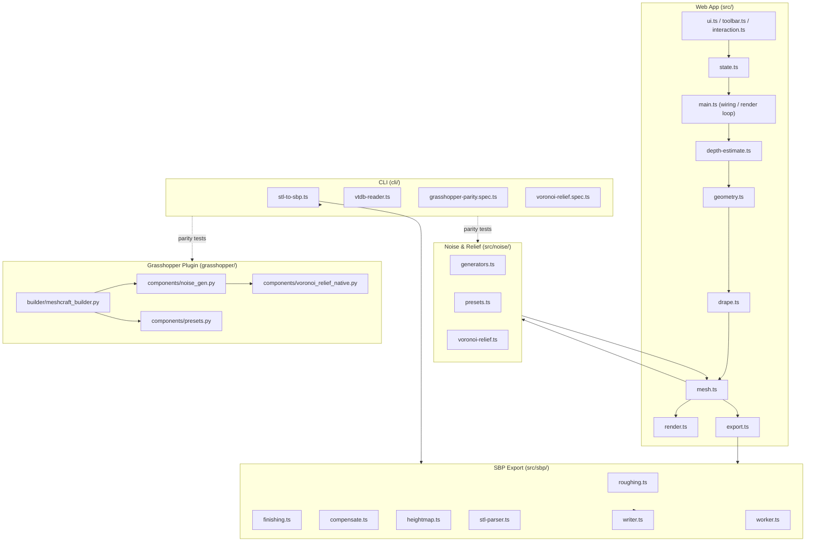
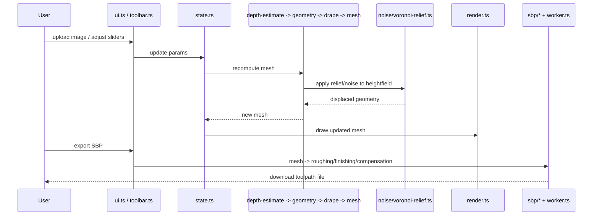

<!-- Captured from the Greptile knowledge base 2026-07-29. Greptile generated this from the
codebase and grounded its review findings in it; it is not hand-authored SOT.
Verify against live code before citing it as authoritative. -->

_Knowledge Base updated: 2026-07-19_

## Orientation

**mesh-maker** is a browser-based tool that turns a source image (via depth estimation) into a 3D relief mesh, applies procedural noise/texture, and exports either a printable/millable mesh or CNC toolpaths (SBP) — with a parallel Grasshopper/Rhino plugin that ports the same noise and relief algorithms into a native CAD component pipeline.

**Main parts:**
- `src/` — the web app: depth estimation, geometry/mesh construction, draping, noise, UI, state, and rendering
- `src/noise/` — procedural noise generators and presets, including the Voronoi relief algorithm
- `src/sbp/` — CNC toolpath (SBP) generation pipeline: roughing, finishing, compensation, heightmaps, STL parsing, and a worker
- `grasshopper/` — a Grasshopper/Rhino plugin (Python) that mirrors the noise/relief logic as native CAD components
- `cli/` — command-line specs/tools that verify parity between the TS and Grasshopper implementations, and a standalone STL→SBP converter

**Where state lives:** all state is client-side/in-process — `src/state.ts` holds the app's live in-memory session state (params, mesh, UI selections); there is no database, queue, or external store. Generated meshes and SBP output are produced on demand and downloaded/exported directly from the browser or CLI.

## Architecture diagrams

## Glossary

- **SBP** — the ShopBot CNC toolpath file format produced by `src/sbp/writer.ts` for milling the generated relief.
- **Voronoi relief** — a procedural noise/relief algorithm (`src/noise/voronoi-relief.ts`) with a native port in Grasshopper (`voronoi_relief_native.py`), verified for parity via `cli/voronoi-relief.spec.ts`.
- **Drape** — the process (`src/drape.ts`) of conforming generated geometry to a base surface/heightfield.
- **GH** — shorthand for Grasshopper, the Rhino visual-programming plugin ported in `grasshopper/`.
- **Parity spec** — a CLI test (`cli/grasshopper-parity.spec.ts`) asserting the TS and Python/Grasshopper noise implementations produce equivalent output.

## Codebase-wide invariants

- The TypeScript noise algorithms and the Grasshopper Python components are intentionally kept in lockstep and verified by `cli/grasshopper-parity.spec.ts` and `cli/voronoi-relief.spec.ts` — any change to `src/noise/**` or `grasshopper/components/**` should be checked against the other side.
- All app state is held in a single in-memory module, `src/state.ts`; there is no persistence layer or database in this repo.
- SBP toolpath generation is staged strictly as roughing → finishing → compensation before writing, per the separate files in `src/sbp/`.

## Routing table

- `src/depth-estimate.ts`, `src/geometry.ts`, `src/mesh.ts`, `src/drape.ts`, `src/types.ts` -> [docs/mesh-generation-core.md](docs/mesh-generation-core.md)
- `src/noise/**`, `docs/voronoi-relief-target-spec.md` -> [docs/noise-and-relief-system.md](docs/noise-and-relief-system.md)
- `grasshopper/builder/**`, `grasshopper/components/**`, `grasshopper/VORONOI_RELIEF_NATIVE.md`, `grasshopper/mesh-maker.gh` -> [docs/grasshopper-integration.md](docs/grasshopper-integration.md)
- `cli/**`, `stl-to-sbp.sh`, `tsconfig.cli.json` -> [docs/cli-tools.md](docs/cli-tools.md)
- `src/sbp/**`, `src/sbp-export.ts`, `src/export.ts` -> [docs/sbp-export-pipeline.md](docs/sbp-export-pipeline.md)
- `src/state.ts`, `src/ui.ts`, `src/main.ts`, `src/toolbar.ts`, `src/interaction.ts`, `src/render.ts`, `src/slider-utils.ts`, `src/stats.ts`, `src/toast.ts`, `src/sponsor.ts`, `index.html` -> [docs/ui-and-state.md](docs/ui-and-state.md)
