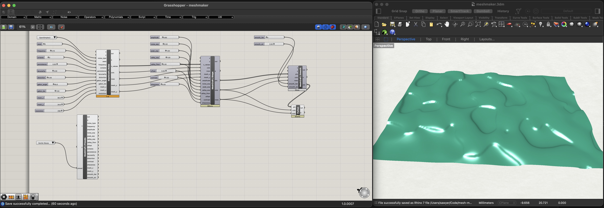
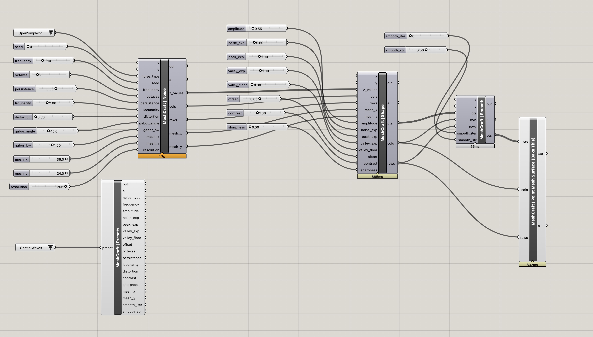

# MeshCraft

<p align="center">
  
</p>

**Browser-based 3D mesh generator and toolpath compiler for CNC machining.**

[**Try it live**](https://meshcraft.sawyerdesign.io) &nbsp;|&nbsp; Built by [Sawyer Design](https://sawyerdesign.io)

<br>

<p align="center">
  
</p>

<h3 align="center">Sponsored by <a href="https://shopbottools.com/products/desktop-max-atc/">ShopBot</a></h3>

<p align="center">
  This project is proudly sponsored by <a href="https://shopbottools.com/products/desktop-max-atc/"><strong>ShopBot Tools</strong></a>.<br>
  MESHCRAFT was built for and tested on the <a href="https://shopbottools.com/products/desktop-max-atc/">ShopBot Desktop Max ATC</a> — a production-grade CNC with automatic tool changing.
</p>

<p align="center">
  <a href="https://shopbottools.com/products/desktop-max-atc/">
    
  </a>
</p>

<p align="center">
  <a href="https://bitsbits.com">
    
  </a>
</p>

<p align="center">
  Powered by <a href="https://bitsbits.com"><strong>bitsbits.com</strong></a>
</p>

---

## What It Does

Generate 3D meshes from procedural noise or depth map images, tuned for CNC machining. Export watertight STL, OBJ, or heightmap PNG -- or compile ShopBot .sbp toolpaths directly, bypassing CAM software entirely.

### Features

- **14+ noise algorithms** — Simplex, Perlin, OpenSimplex2, Value, FBM, Ridged, Billow, Turbulence, Hybrid, Hetero, Domain Warp, Voronoi, Worley, Gabor, Wavelet
- **Depth map import** — Upload any image, blend with noise
- **CNC presets** — 15 presets tuned for the ShopBot Desktop Max ATC (36" x 24", 6" Z)
- **STL-to-SBP toolpaths** — Two-pass roughing + finishing .sbp generation from any binary STL (CLI + web)
- **Watertight export** — Bottom face + side walls for CNC-ready meshes
- **Multiple formats** — STL (binary/ASCII), OBJ, 3DM (mesh or point cloud), heightmap PNG, SBP
- **Real-time 3D preview** — Orbit, pan, zoom with mouse or touch
- **Shareable configs** — Copy Link encodes your mesh settings into a URL

### View Modes

Solid, Wireframe, Both, Points — switch between render modes to inspect your mesh.

## Usage

Visit the live site — no install required:

**https://meshcraft.sawyerdesign.io**

### Local Development

```bash
npm install        # First time
npm run dev        # Vite dev server with HMR (http://localhost:5173)
npm run build      # TypeScript + Vite production build → dist/
npm run preview    # Preview production build locally
```

## Export Workflow

1. Adjust noise parameters or upload a depth map
2. Choose your export format (STL, OBJ, 3DM, Heightmap, or SBP)
3. For 3DM, optionally enable **Export as point cloud** to output vertices only (Rhino/Grasshopper)
4. Enable **Watertight** for CNC milling (adds bottom face + side walls)
5. Click **Export** to download

Exported STL/OBJ files are ready for CAM software like VCarve, Aspire, or Fusion 360. SBP files run directly on ShopBot CNCs -- no CAM software needed.

## Architecture

Vite + TypeScript + Three.js. Hardware-accelerated WebGL rendering with Phong shading, depth buffer, and MSAA anti-aliasing.

```text
src/
├── main.ts              # Entry point, URL state, demo preload
├── state.ts             # Typed STATE singleton, URL serialize/deserialize
├── types.ts             # Shared interfaces (Vertex3D, Triangle, MeshData)
├── noise/
│   ├── generators.ts    # 14+ noise classes + factory
│   └── presets.ts       # 15 CNC presets, 6 texture profiles
├── mesh.ts              # Mesh generation + smoothing
├── render.ts            # Three.js WebGL rendering (Phong shading, OrbitControls)
├── export.ts            # STL, OBJ, heightmap PNG, SBP export dispatcher
├── sbp-export.ts        # Web UI bridge: MeshCraft STATE -> SBP pipeline -> download
├── ui.ts                # Sidebar, sliders, depth map upload, SBP config panel
├── interaction.ts       # Mouse/touch orbit, pan, zoom
├── toolbar.ts           # Mode tabs, toolbar, Copy Link, format-aware controls
├── stats.ts             # Stats overlay (format-aware: triangles or SBP moves)
├── toast.ts             # Toast notifications
├── sponsor.ts           # Sponsor modal
└── sbp/                 # STL-to-SBP pipeline (shared between web + CLI, zero Node deps)
    ├── types.ts         # ToolDef, SbpConfig, ToolpathMove, ToolpathSection
    ├── tools.ts         # Embedded ATC tool database (18 tools, 3 material profiles)
    ├── stl-parser.ts    # Binary STL -> Float32Array + bounding box
    ├── heightmap.ts     # Triangle mesh or STATE vertices -> regular Z grid
    ├── compensate.ts    # Tool compensation (separable morphological erosion)
    ├── roughing.ts      # Z-level stepdown raster
    ├── finishing.ts     # 45-deg continuous zigzag
    ├── writer.ts        # OpenSBP file builder
    ├── generate.ts      # Pipeline orchestrator
    └── worker.ts        # Web Worker for STL upload pipeline

cli/
├── stl-to-sbp.ts        # CLI entry point (Node-only: fs, process)
└── vtdb-reader.ts       # SQLite vtdb reader (better-sqlite3)
```

## STL to SBP

Generate ShopBot .sbp toolpath files directly from any binary STL -- no Vectric Aspire or other CAM software required. Two-pass pipeline: roughing (Z-level raster) + finishing (45-deg continuous zigzag with tool compensation).

### How it works

1. Parse binary STL into a triangle mesh
2. Rasterize to a heightmap (Z grid at configurable resolution, default 200 cells/inch)
3. Apply morphological erosion for tool compensation (separable 1D passes, handles tapered ball nose geometry)
4. Generate roughing toolpath: Z-level stepdown, serpentine raster, skip empty rows
5. Generate finishing toolpath: 45-deg bidirectional zigzag, continuous M3 path with entry/exit retracts
6. Write OpenSBP with full ATC support (tool changes, spindle control, feed rates)

### CLI

```bash
./stl-to-sbp.sh <input.stl> [options]

# or
npm run stl-to-sbp -- <input.stl> [options]
```

Options:

```text
-o, --output <file>          Output .sbp (default: <input>.sbp)
--vtdb <file>                Vectric tool database (.vtdb)
--roughing-tool <pattern>    Match tool by name substring
--finishing-tool <pattern>   Match tool by name substring
--roughing-atc <N>           Override ATC slot
--finishing-atc <N>          Override ATC slot
--resolution <N>             Heightmap cells/inch (default: 200)
--material-thickness <N>     Material Z in inches (default: STL Z max)
--material <profile>         general | mdf | hardwood (default: general)
--offset-x <N>               Workpiece X offset (default: 2.0)
--offset-y <N>               Workpiece Y offset (default: 2.0)
--safe-z <N>                 Safe Z height (default: 1.6)
--home-z <N>                 Home Z height (default: 2.3)
--stock-allowance <N>        Leave stock for finishing (default: 0.02)
--finish-angle <N>           Raster angle in degrees (default: 45)
--roughing-only              Skip finishing pass
--finishing-only             Skip roughing pass
--dry-run                    Print stats without writing file
```

The CLI reads Vectric `.vtdb` tool databases (SQLite) via `--vtdb` for cutting parameters. Without `--vtdb`, it uses embedded tool data covering 18 tools across 3 material profiles (General, MDF, Hardwood).

### Web

Select **SBP** as the export format in the toolbar. The SBP config panel appears in the sidebar with tool selection, material profile, and roughing/finishing toggles. Two modes:

1. **From mesh**: Exports the current MeshCraft mesh directly (instant)
2. **From STL upload**: Upload any binary STL file -- runs the full pipeline in a Web Worker to keep the UI responsive

### Tool library

18 tools from the ShopBot Desktop Max ATC rack, organized by ATC slot position:

| Slot | Tools |
|------|-------|
| 1 | 1.25" Surfacing EM |
| 2 | 1.25" 90-deg V-Bit |
| 3 | 3/8" Chipbreaker EM (default roughing) |
| 4 | 0.25" BN Spiral EM, 3/8" Radiused EM |
| 5 | 3/8" Straight BN, 1/4" Spiral BN |
| 6 | 1/8" Spiral Upcut, 1/4" O-Flute EM |
| 7 | TBN R1/32-S1/4, TBN R1/16-S1/4 (default finishing) |

Each tool has cutting data for all three material profiles (General, MDF, Hardwood) with feed rates, plunge rates, RPM, stepdown, and stepover.

### Known limitations

- **Heightfield meshes only** -- one Z per XY cell. No overhangs or undercuts.
- **Raster roughing** -- ~20-40% more air-cutting than Aspire's contour spiral. Same material removal.
- **Uniform point density** -- 0.005" between M3 points (vs Aspire's adaptive 0.012-0.024"). Larger files, same stepover, negligible cycle time difference.
- **Web SBP is gated** -- button hidden in production until physical carve validation passes.

---

## Grasshopper / Rhino 7

MESHCRAFT is also available as a Grasshopper node set for Rhino 7. All 15 noise algorithms, shaping controls, smoothing, and CNC presets — running natively inside Grasshopper with real-time mesh output.

<p align="center">
  
</p>

<p align="center">
  
</p>

### Quick Start

1. Open `grasshopper/meshmaker.gh` in Grasshopper (Rhino 7)
2. Adjust sliders — the mesh updates live in the Rhino viewport
3. Bake the mesh output when ready

The definition is also saved as `grasshopper/meshmaker.3dm` for direct use in Rhino.

### Node Architecture

The pipeline uses GhPython wrappers backed by a compiled C# DLL (`MeshCraftNoise.dll`) for performance. IronPython 2.7 is 1000-7000x slower than compiled C# for tight numeric loops, so all heavy math (noise generation, shaping, smoothing, face index computation) runs in the DLL while the GhPython scripts handle I/O and Grasshopper data marshaling.

| Component | Role | Key Inputs |
|---|---|---|
| **MeshCraft \| Noise** | Generates raw noise heightfield (DLL) | noise type, seed, frequency, octaves, persistence, lacunarity, distortion, gabor angle/bandwidth, mesh dimensions, resolution |
| **MeshCraft \| Shape** | Two-pass normalize + shape (DLL), optional smooth | amplitude, noise exponent, peak/valley exponents, valley floor, offset, contrast, sharpness, smooth_iter, smooth_str |
| **MeshCraft \| Smooth** | Optional weighted Laplacian smoother (C# Script) | iterations (0-8), strength (0-1) |
| **MeshCraft \| Presets** | Outputs all params for a named CNC preset | preset name (15 presets) |
| **To Mesh** | Converts point grid to quad mesh surface (DLL face math) | pts, cols, rows, watertight |

### DLL Setup

The compiled DLL (`MeshCraftNoise.dll`) must be installed for the Grasshopper nodes to function.

**Source:** `grasshopper/ghpy/MeshCraftNoise.cs`

**Install location (Rhino 7 macOS):**

```text
~/Library/Application Support/McNeel/Rhinoceros/7.0/Plug-ins/Grasshopper (b45a29b1-4343-4035-989e-044e8580d9cf)/Libraries/
```

**Compiling from source (macOS with Mono):**

```bash
brew install mono   # one-time
mcs -target:library -out:MeshCraftNoise.dll MeshCraftNoise.cs
```

Copy the resulting `.dll` to the GH Libraries folder above, then **restart Rhino** (the DLL is cached in memory on first load).

A precompiled copy is also kept at `grasshopper/ghpy/MeshCraftNoise.dll` for convenience.

**What the DLL contains:**

- `Generate()` -- all 15 noise algorithms
- `Shape()` -- two-pass normalization + CNC z-model mapping (amplitude, contrast, peak/valley shaping)
- `Smooth()` -- weighted Laplacian smoothing on interleaved xyz arrays
- `BuildFaces()` -- quad face index computation for mesh construction

### Watertight Export

The **To Mesh** node accepts a `watertight` boolean input. When enabled, the mesh is closed with a flat bottom face at z=0 and vertical side walls connecting the perimeter top edges to corresponding bottom vertices. This produces a CNC-ready solid that can be exported directly as STL for CAM software.

### Performance

At 128x128 resolution (~16K vertices), the full pipeline completes in under 2 seconds: Node 1 (noise) ~82%, Node 2 (shape) ~10%, Node 3 (smooth) ~1%, Node 4 (surface) ~8%. The web version is still faster due to V8 JIT compilation, but the DLL pattern makes the Grasshopper version interactive at typical CNC resolutions.

### Noise Algorithms

All 15 types are available from the noise type dropdown:

Simplex, Perlin, Value, OpenSimplex2, Ridged, Billow, FBM, Turbulence, Hybrid Multifractal, Hetero Terrain, Domain Warp, Voronoi, Worley, Gabor, Wavelet

### Using Presets

The **MeshCraft | Presets** component is placed on the canvas but **unwired by default**. To use a preset:

1. Select a preset from the dropdown (e.g., "Sculptural", "Deep Carve", "Voronoi Cells")
2. Wire individual preset outputs to the matching inputs on the Noise, Shape, or Smooth components — this overrides the slider value for that parameter
3. To return to manual control, disconnect the preset wire and the slider takes over again

Available presets: Gentle Waves, Organic Terrain, Sharp Ridges, Voronoi Cells, Subtle Texture, Deep Carve, Sculptural, Hard Wave, Eroded Stone, Billowy Clouds, Turbulent Marble, Natural Ridge, Organic Swirl, Worley Cracks, Brushed Metal

### Exporting from Rhino

After baking the mesh:

- **STL/OBJ**: `File > Export Selected` and choose format
- **3DM**: Save the Rhino file directly
- Enable `watertight` on the To Mesh node before baking to get a closed solid for CNC
- Exported meshes match the ShopBot Desktop Max ATC work envelope (36" x 24" default, adjustable via `mesh_x` and `mesh_y` sliders)

### Builder Script

The `grasshopper/builder/` directory contains the Python scripts used to programmatically generate the `.gh` file via the Grasshopper SDK. These are development tools — you don't need them to use the definition.

## License

MIT
